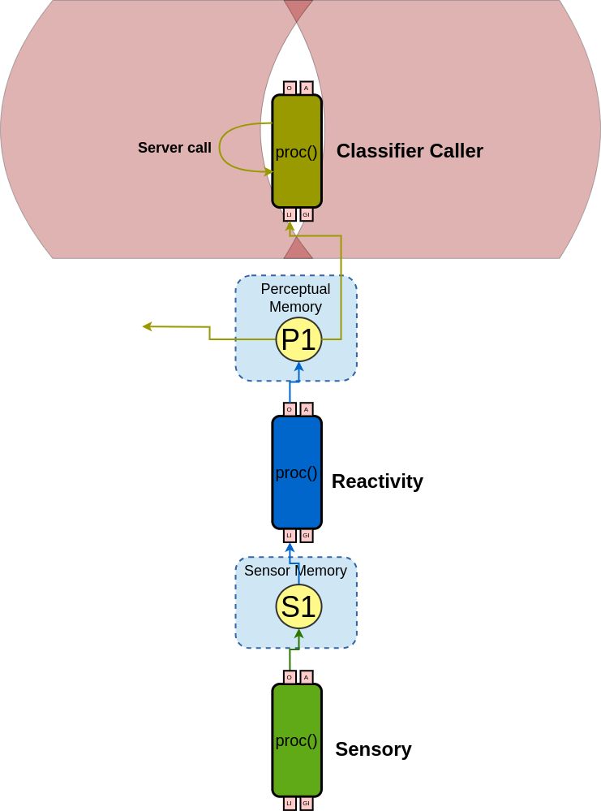

# Axe Agent

This repo contains an example of the use of [CST](https://github.com/CST-Group/cst) REST API, integrating Python code on CST's Java implementation.

The Axe will read a csv file containing a pandas dataframe or a list of numpy arrays and send them - one-by-one - to a server which will pass it through a predefined ML method and classify the entry. We use the simplified [propublica compas dataset for fair ML](https://github.com/adebayoj/fairml/blob/master/doc/example_notebooks/propublica_data_for_fairml.csv) in which the classifier will judge if the subject will reincid or not.
 
 ## How it works

First, you'll need to activate the virtual environment in this repo by running the following command, from the project's root folder:

    ./venv/bin/activate

Then the Flask API server must be run with `IP:port` `method` arguments:
    
    python3 server.py 127.0.0.1:5000 mlp

Notice that we used localhost and port 5000, but this may be customized by changing both the Python script`s arguments and the Java agent's internal (hardcoded) parameter. The 'method' argument can be selected from the six methods in the 'models' folder.

After that, running the Java program will execute the proposed example.

### What is going on?

The - VERY - simple agent will read a csv file, call an external API and print its response on terminal.

The figure below illustrates the Agent's topology.

